# gladia-cli



[](https://github.com/gladiaio/gladia-cli/actions/workflows/main.yml)
[](https://github.com/gladiaio/gladia-cli/releases/latest)
[](LICENSE)
[](go.mod)

**Audio to text, from your terminal.** `gladia` transcribes any audio file or URL with the [Gladia](https://gladia.io) speech-to-text API — 100+ languages, speaker diarization, and code switching, in one command.

It is built for terminals, shell scripts, and pipelines:

- **One command** — `gladia transcribe <file-or-url>` and you have a transcript
- **100+ languages** — auto-detected, constrained to a shortlist, or switched per utterance
- **Speaker diarization** — *who spoke when*, with `--diarize`
- **Pipe-friendly output** — `text`, `json`, `json-full`, `srt`, or `vtt` to stdout
- **Files or URLs** — transcribe a local recording or a remote link, no download step
- **Zero config** — one API key, no project setup, works in CI

**Start here:** [Install](#install) · [Quick start](#quick-start) · [Commands](#commands) · [Language](#language) · [Diarization](#diarization)

## Install

```bash
# macOS & Linux
curl -fsSL https://github.com/gladiaio/gladia-cli/releases/latest/download/install.sh | sh

# Windows (PowerShell)
powershell -c "irm https://github.com/gladiaio/gladia-cli/releases/latest/download/install.ps1 | iex"
```

Other platforms and binaries: [GitHub releases](https://github.com/gladiaio/gladia-cli/releases). Build from source with `make build` (→ `./gladia`).

The installer offers to set up shell tab completion when run interactively. To skip the prompt (e.g. in CI), set `GLADIA_NO_COMPLETION_PROMPT=1`. See [Shell completion](#shell-completion) to configure it manually.

## Quick start

```bash
gladia auth set your_key                    # get one at app.gladia.io/account

gladia transcribe meeting.wav               # transcript to stdout
gladia transcribe podcast.mp3 -o srt        # subtitles instead
gladia transcribe call.wav --diarize        # label who spoke when
gladia languages                            # list supported language codes
```

**Setup once:** get an API key at [app.gladia.io/account](https://app.gladia.io/account), then provide it any of these ways (checked in order):

```bash
export GLADIA_API_KEY=your_key   # 1. environment
gladia auth set your_key         # 2. saved to ~/.gladia (mode 0600)
gladia transcribe … --gladia-key your_key   # 3. per-command flag
```

## Everyday examples

```bash
# Transcribe a local file or a remote URL — no download step
gladia transcribe meeting.wav
gladia transcribe https://example.com/audio.mp3 -o json

# Narrow language detection to a shortlist
gladia transcribe podcast.mp3 --language en,fr,de

# Mixed-language audio: re-detect on every utterance
gladia transcribe mixed.mp3 --code-switching --language en,fr

# Who spoke when, as subtitles
gladia transcribe call.wav --diarize -o srt

# Pick a model
gladia transcribe podcast.mp3 --model solaria-3 --language en

# Machine-readable output straight into a pipeline
gladia transcribe interview.mp3 -o json | jq '.transcription'
```

## Commands

| Command               | Description                                                 |
| --------------------- | ----------------------------------------------------------- |
| `transcribe <source>` | Transcribe an audio file or URL                             |
| `auth set <key>`      | Save API key to `~/.gladia`                                 |
| `languages`           | List supported ISO 639-1 codes                              |
| `completion <shell>`  | Generate shell tab completion (bash, zsh, fish, powershell) |

### Flags (`transcribe`)

| Flag                       | Default | Description                                                                                                                                              |
| -------------------------- | ------- | -------------------------------------------------------------------------------------------------------------------------------------------------------- |
| `-o`, `--output`           | `text`  | Output: `text`, `json`, `json-full`, `srt`, `vtt`                                                                                                        |
| `--language`               | —       | Expected language(s), comma-separated (`en` or `en,fr,de`); narrows detection, does not enable code switching                                            |
| `--cs`, `--code-switching` | off     | Re-detect language on each utterance (mixed-language audio; solaria-1 only)                                                                              |
| `--diarize`                | off     | Identify speakers in the transcript                                                                                                                      |
| `--model`                  | —       | STT model: `solaria-1` or `solaria-3`. Solaria-3 accepts at most one `--language` (`en`, `fr`, `de`, `es`, or `it`) and does not support code switching. |
| `-v`, `--verbose`          | off     | Show progress while polling                                                                                                                              |

**Global flag** (any command): `--gladia-key` — API key if not in the environment or `~/.gladia`.

## Language

| Goal                | What to run                                                  |
| ------------------- | ----------------------------------------------------------- |
| Auto-detect         | `transcribe <source>`                                        |
| Constrain detection | `--language en,fr,de` (no code switching)                    |
| Code switching      | `--cs` or `--code-switching` (+ optional `--language` hints) |

- **`--language`** limits which language(s) Gladia considers (`en,fr,de` is a hint list, not per-utterance switching).
- **`--cs`** / **`--code-switching`** turns on per-utterance language detection. Add `--language` to restrict which languages may appear. Not available with `solaria-3`.

```bash
gladia languages   # list valid codes
```

## Diarization

Use **`--diarize`** when you need **who spoke when**. Off by default.

- Works with any output format; most useful with `-o text`, `srt`, or `vtt`.
- Speaker labels are included in the output (e.g. `Speaker 0: …`).

```bash
gladia transcribe meeting.wav --diarize
gladia transcribe panel.mp3 --diarize -o srt
```

## Shell completion

When you install via `install.sh` or `install.ps1`, the script asks whether to configure tab completion for your shell. You can also set it up manually — `gladia completion --help` lists every shell.

<details>
<summary><strong>bash</strong></summary>

Requires the [bash-completion](https://github.com/scop/bash-completion) package (on macOS: `brew install bash-completion@2`).

```bash
# current session
source <(gladia completion bash)

# persistent (user directory)
mkdir -p ~/.local/share/bash-completion/completions
gladia completion bash > ~/.local/share/bash-completion/completions/gladia
```
</details>

<details>
<summary><strong>zsh</strong></summary>

```bash
mkdir -p ~/.zsh/completions
gladia completion zsh > ~/.zsh/completions/_gladia

# add to ~/.zshrc if not already present:
# fpath=(~/.zsh/completions $fpath)
# autoload -U compinit; compinit
```
</details>

<details>
<summary><strong>fish</strong></summary>

```bash
mkdir -p ~/.config/fish/completions
gladia completion fish > ~/.config/fish/completions/gladia.fish
```
</details>

<details>
<summary><strong>PowerShell</strong></summary>

```powershell
gladia completion powershell | Out-File -Append -Encoding utf8 $PROFILE
```
</details>

Restart your shell after installing completions.

## Develop

```bash
make build && make test && make dist
```

## License

[MIT](LICENSE) © Gladia
